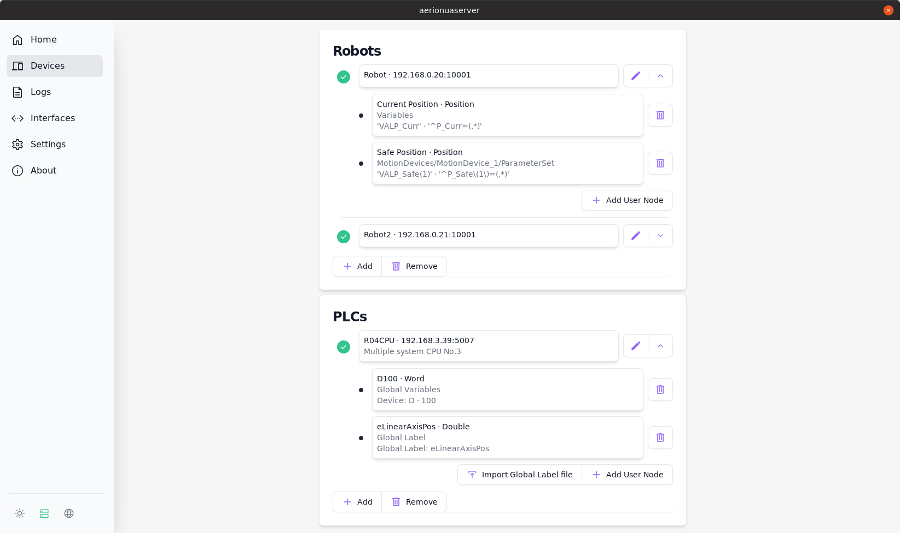

[![Badge License]](https://github.com/SirWalross/aerionuaserver/blob/main/LICENSE) [![Badge Tests]](https://github.com/SirWalross/aerionuaserver/actions) [![Badge Latest Release]](https://github.com/SirWalross/aerionuaserver/releases/latest)

[![Button Building]](https://github.com/SirWalross/aerionuaserver/blob/main/BuildingFromSource.md) [![Button Robot User Nodes]](https://github.com/SirWalross/aerionuaserver/blob/main/RobotUserNodeFormat.md) [![Button PLC User Nodes]](https://github.com/SirWalross/aerionuaserver/blob/main/PLCUserNodeFormat.md)

 
 

# Aerion - a OPC-UA Server for MELFA Robots and MELSEC PLCs

 

<picture>
  <source media="(prefers-color-scheme: light)" srcset="resources/aerionuaserver-light.png" width="800">
  <source media="(prefers-color-scheme: dark)" srcset="resources/aerionuaserver-dark.png" width="800">
  
</picture>

 
 

## MELFA Robots
- Support for F-Series and FR-Series MELFA Robots
- Implements the OPC-UA Robotics Companion Specification for MELFA Robots
- See [https://reference.opcfoundation.org/Robotics/v100/docs](https://reference.opcfoundation.org/Robotics/v100/docs) for the opc-ua robotics companion specification
- Support for User Nodes to add further robot variables like the current position or more I/O

## PLCs
- Support for iQ-R PLCs
- Support for User Nodes to add global label or devices

## Features
- Support for OPC-UA Encryption with the `Basic256Sha256` and `Aes128Sha256RsaOaep` encryption algorithms supported
- Enforcement of client certificate verification supported

## Installation on Windows
- Download and install the `.msi` file from the [latest release](https://github.com/SirWalross/aerionuaserver/releases/latest)

## Installation on Ubuntu 20.04 and up
- Download the `.deb` file from the [latest release](https://github.com/SirWalross/aerionuaserver/releases/latest)
- Run `sudo dpkg -i <deb-file>` to install the `.deb` file
- Run the server with `aerionuaserver`

<!---------------------------------[ Badges ]---------------------------------->

[Badge License]: https://img.shields.io/github/license/SirWalross/aerionuaserver?color=336887&style=for-the-badge&labelColor=458cb5
[Badge Tests]: https://img.shields.io/github/actions/workflow/status/SirWalross/aerionuaserver/ci.yaml?branch=main&style=for-the-badge&labelColor=gray&logoColor=white&logo=GITHUB
[Badge Latest Release]: https://img.shields.io/github/v/release/SirWalross/aerionuaserver?label=Latest%20Release&style=for-the-badge&labelColor=bb9f3e&color=937d31

<!---------------------------------[ Buttons ]--------------------------------->

[Button Building]: https://img.shields.io/badge/Building_from_source-blue?style=for-the-badge&logoColor=white&logo=GitBook
[Button Robot User Nodes]: https://img.shields.io/badge/Robot_User_Node_Format-569A31?style=for-the-badge&logoColor=white&logo=ROS
[Button PLC User Nodes]: https://img.shields.io/badge/PLC_User_Node_Format-e2467d?style=for-the-badge&logoColor=white&logo=ROS